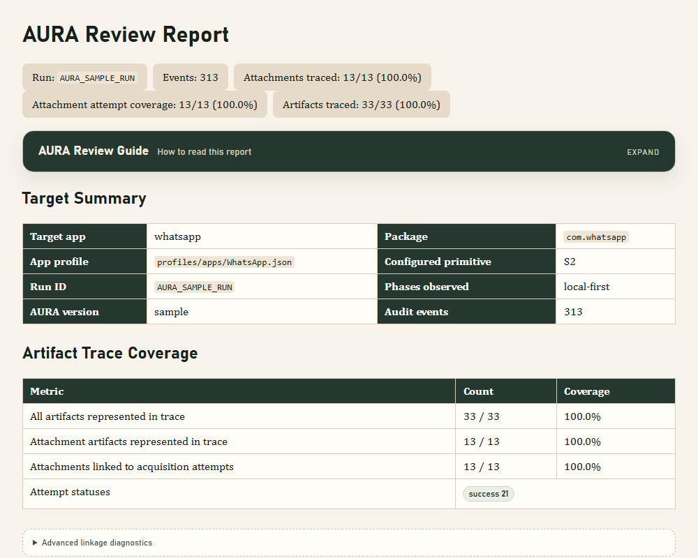

<div align="center">

# AURA

**Auditable UI-mediated Retrieval and Acquisition**

UI-mediated mobile messenger acquisition with reviewable audit trails and acquisition-context linkage.


</div>

---

AURA drives Android messenger apps through `uiautomator2`, captures UI-visible data and supporting artifacts, records every meaningful action in an append-only audit ledger, stores normalized evidence relationships in SQLite, and packages review-ready outputs for downstream analysis.

> **Research prototype**  
> AURA is intended for authorized device analysis and controlled experiments. It is not designed to bypass access controls, hide automation, or acquire data without consent.

> **Implementation details**  
> For a deeper engineering handoff covering profiles, collectors, audit logging, storage schema, Bluetooth export handling, OCR boundaries, and validation scope, see [docs/IMPLEMENTATION_DETAILS.md](docs/IMPLEMENTATION_DETAILS.md).

## Quick Navigation

| Start Here | Understand Outputs | Review Evidence | Scope |
|---|---|---|---|
| [Quick Start](#-quick-start) | [Output Bundle](#-output-bundle) | [Sample Report](#-sample-audit-review-report) | [Validation Environment](#-validation-environment) |
| [Configured Primitive Matrix](#-configured-primitive-matrix) | [Database Model](#-database-model) | [Reviewing A Run](#-reviewing-a-run) | [Current Limitations](#-current-limitations) |

## Snapshot

| &#x1F9FE; Audit First | &#x1F4F1; Multi-App | &#x1F517; Evidence Linked | &#x1F9ED; Review Ready |
|---|---|---|---|
| `AURA_audit.log` records lifecycle, UI, host, wait, failure, and recovery events. | Telegram, WhatsApp, and WeChat use profile-selected acquisition primitives. | Artifacts are linked to phase, account, chat, message, observation, action, and screen. | SQLite DB, JSON review, HTML timeline, ZIP bundle, and integrity manifest are generated per run. |

## &#x1F9ED; Sample Audit Review Report

AURA generates a reviewer-facing HTML report from the raw audit JSONL and normalized SQLite records.



Interactive sample HTML is included at [`docs/examples/AURA_audit_timeline_sample.html`](docs/examples/AURA_audit_timeline_sample.html). GitHub shows repository HTML files as source; for rendered browsing, open it locally or publish `/docs` through GitHub Pages.

How to read the coverage numbers:

- **Attachments traced** shows whether content-bearing attachment artifacts are represented in the acquisition trace table.
- **Attachment attempt coverage** shows whether attachment artifacts can be linked to an acquisition attempt, including success, missing, failed, or ambiguous outcomes.
- **Artifacts traced** covers all registered artifacts, including attachments, exports, screenshots, UI trees, OCR sidecars, and support files.
- **Advanced linkage diagnostics** separates direct audit-event linkage from acquisition-attempt linkage. Values below 100% can be expected because screenshots, UI trees, and other support artifacts often do not have acquisition-attempt records.

## &#x2726; Why AURA Exists

Mobile messengers increasingly resist direct database extraction or expose data only through app-controlled UI paths. AURA therefore treats the UI-mediated acquisition path itself as visible, logged, and reviewable evidence.

The core idea is simple:

```text
UI action -> observed screen/context -> acquired artifact -> normalized record -> reviewable audit trail
```

AURA does not only ask "what file was collected?" It also records:

- Which app, phase, account, chat, message, or observation was active.
- Which UI or host-side action produced the artifact.
- Whether the action succeeded, failed, timed out, recovered, or was skipped.
- Which screenshots, UI trees, OCR sidecars, export files, and hashes support the result.

## &#x25CE; Configured Primitive Matrix

The acquisition primitives are general, complementary, and selected by profiles. The table below describes the current AURA instantiation, not a fixed one-to-one binding between a primitive and an app.

| Target profile | Package | Configured primitive | Current acquisition route |
|---|---|---|---|
| Telegram | `org.telegram.messenger` | `S1` | UI hierarchy-mediated chat/message/attachment acquisition with state predicates and device file snapshot diffs |
| WhatsApp | `com.whatsapp` | `S2` | WhatsApp Export Chat through Android share sheet and Windows Bluetooth receiver, followed by export ZIP parsing |
| WeChat | `com.tencent.mm` | `S3` | OCR-based chat list and chat history acquisition when reliable node-tree access is unavailable |

## &#x2728; What Stands Out

| Capability | What it gives you |
|---|---|
| &#x1F9FE; Audit by design | Key UI, host, wait, failure, recovery, packaging, and post-acquisition events are logged to JSONL and imported into SQLite. |
| &#x1F517; Acquisition-context linkage | Artifacts are tied back to source actions, screens, phases, chats, messages, observations, and acquisition attempts. |
| &#x1F9ED; Review-ready outputs | AURA emits a raw audit log, normalized `aura.db`, review JSON, review HTML, ZIP bundle, and integrity manifest. |
| &#x1F6E1; Bounded UI automation | Important UI actions use predicates, safe clicks, stable-poll checks, and bounded recovery instead of unbounded blind traversal. |
| &#x1F9E9; Profile-selected primitives | Telegram, WhatsApp, and WeChat currently use different configured primitives while sharing one audit/storage model. |

## &#x1F3AC; Demo Videos

Add demonstration videos here when available.

| Scenario | Video | Notes |
|---|---|---|
| &#x1F4E1; Telegram profile with S1 | TBD | Add a link or embedded demo showing phase transition, chat traversal, and attachment capture. |
| &#x1F7E2; WhatsApp profile with S2 | TBD | Add a link or embedded demo showing pairing, Export Chat, receiver finish, and ZIP parsing. |
| &#x1F4AC; WeChat profile with S3 | TBD | Add a link or embedded demo showing OCR chat list/history traversal. |
| &#x1F9ED; Audit review workflow | TBD | Add a link or embedded demo showing `AURA_audit_timeline.html` and `aura.db` review. |

## &#x26A1; Quick Start

### 1. Install Dependencies

```powershell
pip install -r requirements.txt
```

### 2. Connect Android Device

Requirements:

- Android device is connected through ADB.
- The lock screen is dismissed before execution. Root access or bootloader unlock is not required.
- `uiautomator2` can connect to the device.
- Use `--serial` when multiple devices are connected.

Check devices:

```powershell
adb devices
```

### 3. Run AURA

```powershell
# Telegram profile configured with S1
python main.py --target telegram --serial <ADB_SERIAL>

# WhatsApp profile configured with S2
python main.py --target whatsapp --serial <ADB_SERIAL>

# WeChat profile configured with S3
python main.py --target wechat --serial <ADB_SERIAL>
```

Default output root:

```text
runs/
```

Useful debug run:

```powershell
python main.py --target telegram --serial <ADB_SERIAL> --runs-dir runs --keep-run-dir --log-level DEBUG
```

## &#x1F9F0; CLI Options

| Option | Default | Description |
|---|---|---|
| `--target` | `telegram` | Target app: `telegram`, `whatsapp`, or `wechat`. |
| `--serial` | not set | ADB device serial. Omit only when exactly one device is connected. |
| `--runs-dir` | `runs` | Output root for run directories, ZIP bundles, and summary reports. |
| `--keep-run-dir` | disabled | Keep unpacked artifacts after ZIP packaging. Recommended while debugging. |
| `--log-level` | `INFO` | Use `DEBUG` for low-level state-machine and safe-click logs. |

## &#x1F9EA; Procedure Model

AURA is profile-driven. App acquisition profiles live under `profiles/apps/`, while OEM/system settings profiles live under `profiles/system_ui/`.

```text
profiles/
  apps/          # Telegram, WhatsApp, WeChat acquisition profiles
  system_ui/     # Generic Android/Pixel, Samsung, and Huawei system UI profiles
```

At runtime, AURA loads the target profile, resolves the system UI profile, initializes device policy, executes the configured primitive, registers artifacts, imports the audit JSONL into SQLite, builds review JSON/HTML, and packages the run.

```text
AURA run
  -> load target profile
  -> resolve system UI profile
  -> enforce phase policy
  -> run orchestrator
      -> adapter -> configured primitive -> collector
      -> app-specific acquisition
      -> artifact/message/attempt storage
  -> import audit JSONL into aura.db
  -> build audit review JSON/HTML
  -> create ZIP + summary report
```

### Phase Policies

| Phase | Purpose | Typical Device Policy |
|---|---|---|
| `local-first` | Acquire locally available app-visible data before controlled network synchronization. | Airplane mode on, DND on, Wi-Fi off. |
| `controlled-online` | Re-enable controlled Wi-Fi and acquire app-visible data after synchronization. | Airplane mode on, DND on, Wi-Fi on and connected, app restart, short sync settle. |

Legacy labels such as `offline`, `online`, `phase1`, and `phase2` are normalized internally to `local-first` and `controlled-online`.

## &#x1F4E6; Output Bundle

Each run produces a timestamped bundle:

```text
AURA_YYYYMMDD_HHMMSS.zip
AURA_YYYYMMDD_HHMMSS_report.json
```

When `--keep-run-dir` is enabled, the unpacked directory is also kept:

```text
AURA_YYYYMMDD_HHMMSS/
  AURA_audit.log
  AURA_audit_review.json
  AURA_audit_timeline.html
  aura.db
  collection_timing.json
  device_info.json
  preflight_local-first.json
  preflight_controlled-online.json
  telegram/
  whatsapp/
  wechat/
```

### Primary Outputs

| Output | Role |
|---|---|
| &#x1F5C4; `aura.db` | Normalized SQLite database for contacts, chatrooms, messages, observations, artifacts, audit events, and acquisition attempts. |
| &#x1F9FE; `AURA_audit.log` | Append-only JSONL event ledger for lifecycle, UI actions, waits, failures, recovery, and packaging. |
| &#x1F9ED; `AURA_audit_review.json` | Review-oriented summary generated from `audit_events`. |
| &#x1F310; `AURA_audit_timeline.html` | Human-readable audit review with phase summary, artifact summary, key events, and raw JSON details. |
| &#x1F4E6; `AURA_*.zip` | Packaged acquisition bundle. |
| &#x1F510; `AURA_*_report.json` | Run summary and archive manifest with file size/SHA-256 metadata. |
| &#x1F5BC; Evidence files | Screenshots, UI XML trees, OCR sidecars, timeout captures, exported chats, extracted attachments, downloaded files. |

## &#x1F9ED; Audit Review

AURA keeps the append-only JSONL audit log as the chronological record, then builds review layers from it:

- **Phase Summary**: event count, failures, recovered non-success, benign non-success, and action chips.
- **Artifact Trace Coverage**: highlights attachment trace coverage and attempt coverage, with lower-level linkage diagnostics folded under advanced details.
- **Artifact Summary**: artifact groups by phase, artifact kind, source action, and source screen.
- **Artifact Acquisition Trace**: per-artifact context, source action, audit event, and acquisition attempt details.
- **Attention Required / Recovered / Benign**: separates unresolved non-success, recovered transient failures, and expected non-critical waits.
- **Raw JSON Details**: keeps exact audit payloads folded inside the HTML for sequence reconstruction.

See the [anonymized sample report](docs/examples/AURA_audit_timeline_sample.html) for the intended review experience.

## &#x1F5C4; Database Model

AURA stores normalized records in SQLite while keeping raw evidence files in the run package.

| Area | Representative tables/views | Purpose |
|---|---|---|
| Context | `runs`, `collection_contexts` | Run, app, phase, account, and policy context. |
| Logical records | `contacts`, `chatrooms`, `messages` | Normalized entities extracted from UI-visible content. |
| Observations | `chatroom_observations`, `message_observations` | UI/OCR observations that support logical records. |
| Evidence | `artifacts`, `attachment_artifacts` | Screenshots, XML, OCR sidecars, exports, attachments, and downloaded files with hashes. |
| Audit and linkage | `audit_events`, `artifact_action_context_links`, `acquisition_attempts` | Event sequence, acquisition-context linkage, and success/missing/failed/ambiguous attempts. |

For table-level details, see [docs/IMPLEMENTATION_DETAILS.md](docs/IMPLEMENTATION_DETAILS.md).

## &#x1F4F1; App Strategies

### &#x1F4E1; Telegram Profile Configured With S1

Telegram uses UI hierarchy parsing and state-aware navigation.

Key behaviors:

- Phase-aware collection across `local-first` and `controlled-online`.
- App restart after phase preflight.
- Controlled-online Wi-Fi connection and app sync settle.
- Safe click transactions for important UI actions.
- Chat list and chat history traversal with safe bounds.
- Message parsing from UI tree.
- Attachment acquisition by before/after Android filesystem snapshot diff.
- Attachment identity policy for weak media rows and stronger file rows.
- Device-side cleanup for newly downloaded Telegram files after successful copy/hash.

Attachment identity is deliberately split:

| Identity | Meaning |
|---|---|
| `display_filename` | Filename or label shown in the Telegram UI. |
| `device_path` / `device_basename` | Actual Android filesystem artifact created by Telegram/Android. |
| `sha256` / `content_group_id` | Content identity after acquisition. |
| `observation_id` | Run-local UI observation/action identity. |
| `record_id` | Storage identity for the message row. |

### &#x1F7E2; WhatsApp Profile Configured With S2

WhatsApp uses the official Export Chat UI route and Windows Bluetooth receive.

Key behaviors:

- Chat list discovery with screenshots and UI XML.
- Bluetooth preconnect during preflight.
- Host PC device name resolution.
- Android Bluetooth pairing and target selection.
- Windows receiver preparation around export time.
- Export Chat with Include Media where available.
- Android share sheet capture.
- Bluetooth target selection, including horizontal share-sheet navigation when needed.
- Receiver finish/progress screenshot capture.
- Received ZIP/file collection from host Bluetooth exchange directories.
- Export ZIP parsing and attachment extraction.
- Missing export attachments are recorded as `status=missing` acquisition attempts when the text export references media that is absent from the received ZIP.
- Post-acquisition audit events summarize export materialization, archive registration, extraction, parser input, attachment validation, DB commit counts, and missing-attachment warnings.
- Optional Bluetooth unpair and initial state restoration.

### &#x1F4AC; WeChat Profile Configured With S3

WeChat uses OCR because reliable node tree extraction is not available.

Key behaviors:

- OCR engine preflight.
- Screenshot-based chat list capture.
- OCR sidecar generation.
- Heuristic safe area calculation.
- Recent-overlay guard.
- Chat history traversal by visual/OCR stagnation conditions.
- High safety cap for long histories.
- Message storage with OCR-derived observations.

WeChat is intentionally conservative: OCR instability is recorded and bounded rather than hidden.

## &#x1F6E1; Stability Primitives

AURA's collectors share a small set of reliability primitives for UI state confirmation, bounded navigation, and artifact registration.

| Primitive | Purpose |
|---|---|
| `safe_click()` | Execute a UI click and verify the expected screen state. |
| `wait_for_screen_state()` | Poll a predicate until a screen is confirmed or times out. |
| `wait_for_visual_stable()` | Confirm visual stability through repeated screenshot hashes. |
| `wait_for_consecutive_match()` | Require a sampled condition to match for N consecutive polls. |
| `wait_for_consecutive_same_sample()` | Require a sampled value to remain stable for N consecutive polls. |
| `press_back_to_state()` | Bounded back navigation with state confirmation. |
| `capture_visual_evidence()` | Screenshot and optional UI XML capture with artifact registration. |
| `register_artifact()` | Insert artifact metadata, write audit linkage event, and queue hashing. |

These primitives reduce reliance on blind sleeps and make UI uncertainty reviewable.

## &#x1F9ED; Reviewing A Run

Start with these outputs:

| File | What To Check |
|---|---|
| `AURA_audit_timeline.html` | Fast human triage of phase status, failures, recovered events, and artifact groups. |
| `AURA_audit_review.json` | Structured review summary for tooling. |
| `AURA_audit.log` | Raw event stream with exact sequence and context. |
| `aura.db` | Normalized records, attempts, artifacts, and audit events. |
| `_screen_state_timeouts/` | Screenshot/XML captures for failed state checks. |
| `preflight_*.json` | Network/DND/Wi-Fi and method-specific preflight status. |
| `collection_timing.json` | Run and phase timing. |

The intended review order is:

```text
HTML timeline
  -> unresolved failures and recovered events
  -> artifact groups
  -> SQLite message/artifact views
  -> raw JSONL only when exact sequence reconstruction is needed
```

## &#x1F9EA; Validation Environment

AURA has been exercised on representative Android devices to validate profile-driven app acquisition and OEM/system UI handling. These devices describe the current validation environment, not a fixed device requirement.

| Device | Android | OEM / UI | System UI profile | Notes |
|---|---:|---|---|---|
| Samsung Galaxy S8 | 9 | One UI 1.0 | `samsung` | Legacy Samsung DND, Bluetooth, and Settings behavior. |
| Samsung Galaxy S21 5G | 14 | One UI 6.1 | `samsung` | Modern Samsung DND, share sheet, Bluetooth, and recent-apps behavior. |
| Google Pixel 5 | 14 | Pixel / AOSP-like UI | `generic` | Generic Android/Pixel DND, recent-apps, and share sheet behavior. |
| Huawei P30 Lite | 9 | EMUI 9.1.0 | `huawei` | Huawei Settings, DND, recent-apps, and Bluetooth behavior. |

## &#x1F6A7; Scope Notes

- AURA is a research prototype for authorized, controlled acquisition experiments.
- It prioritizes auditability and repeatability over speed.
- UI automation is intentionally visible and logged.
- Root access and bootloader unlock are not required.
- App behavior, Android version, and OEM Settings UI can affect collection routes.

## &#x26A0; Current Limitations

- WeChat remains OCR-dependent, so row extraction and message parsing are less deterministic than Telegram/WhatsApp.
- WhatsApp export depends on Android share sheet behavior and Windows Bluetooth receiver state.
- Android/OEM Settings screens vary across devices; DND, recent-apps, network, and Bluetooth flows may require new system UI profile entries on new models.
- Time values are preserved, but AURA's primary emphasis is acquisition-context linkage rather than timestamp precision.
- This is a research prototype, not a hardened commercial acquisition suite.

## &#x1F4C4; License

This project is licensed under the Apache License 2.0. See `LICENSE` for details.
